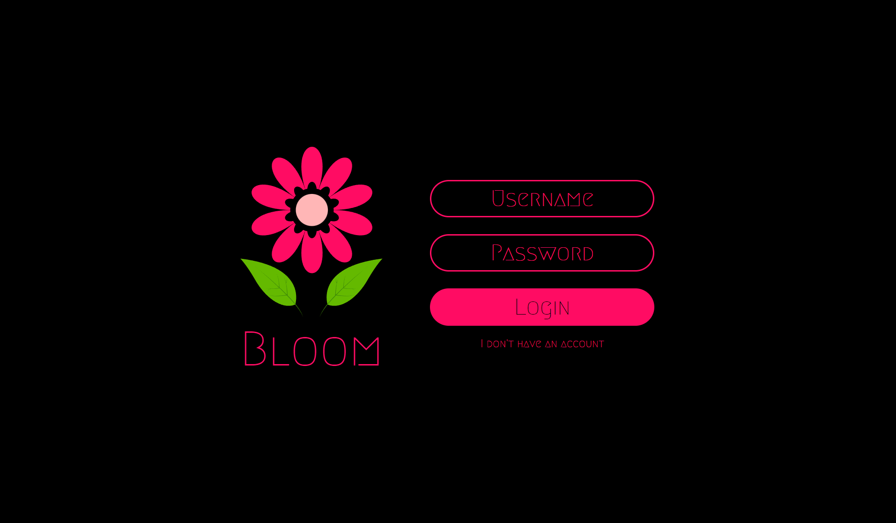
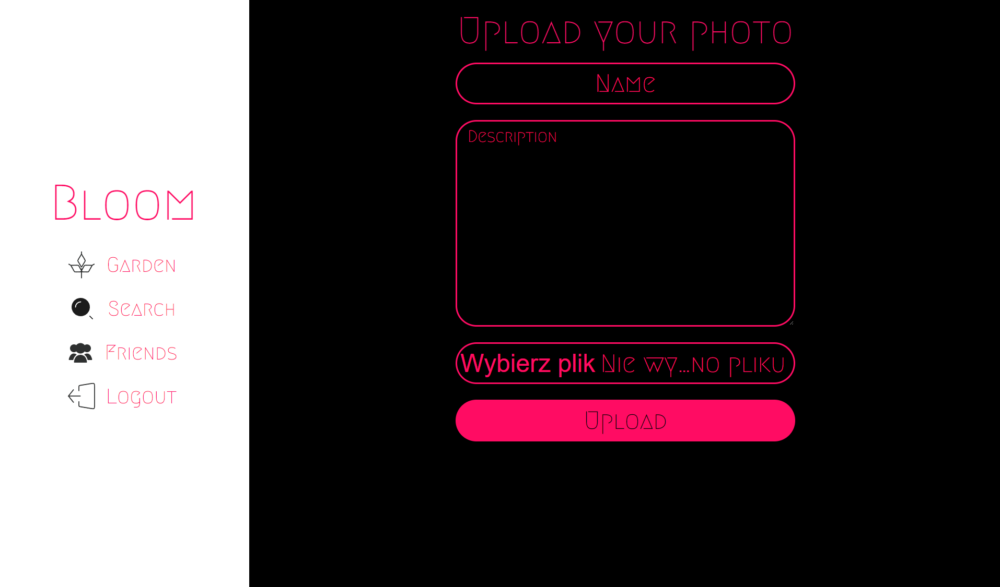

# BLOOM

## Table of contents
- [About](#about)
- [Tech Stack](#tech-stack)
- [Requirements](#requirements)
- [Installation](#installation)
- [Screenshots](#screenshots)
- [ER Diagram](#er-diagram)

## About
Social media application.
After registration user can browser other users and add them to friends.
Each user can upload photos and view photos of other users.
Admin has ability to remove users' accounts from app.

## Tech Stack
- Docker
- JavaScript
- PHP
- HTML
- CSS
- PostgreSQL

## Requirements
- [Docker](https://www.docker.com/)

## Installation
- Run `docker compose up` command in main project folder
- Import data from `dummy.sql` to database
- Access application at `localhost:8080`

## Screenshots
### Login page

### Register page

### Main page

### Upload photo page

### Search page

### Admin page

### Friends page

### Friends photos page

### Invites page

## ER Diagram

